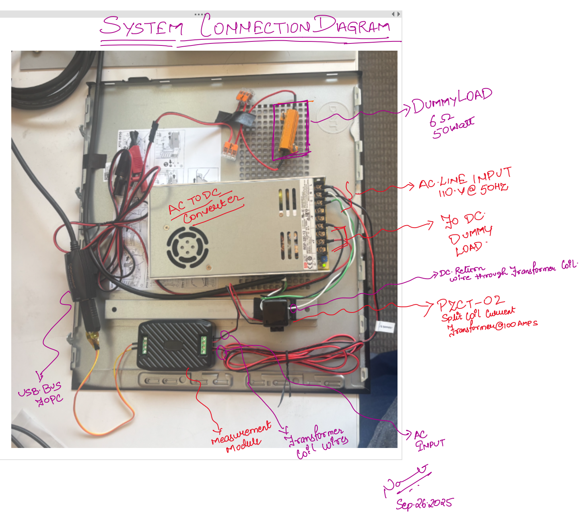

<!-- Jai Guru Dev -->
<!-- AC Measurement System with Modbus Measurement -->


## AC Voltage Current and PowerFactor Measurement System
Author : Navneet Singh <br>
Lang   : Python3       <br> 

This system measures AC voltage (80-260V), current (0-100A), active power (0-23kW), frequency (45-65Hz), power factor (0.00-1.00), and energy consumption through RS485 Modbus-RTU communication protocol. Perfect for power monitoring, generator load balancing, and energy management applications. 

## Table of Contents
- [System Block Diagram](#hardware-block-diagram)
    - [System Description](#system-description)
    - [Component List](#component-list)
- [USB Interface BringUP](#usb-interface-bringup) 
- Set Up Virtual CAN Port
  - [Virtual CAN Setup](#virtual-can-setup)
    - [Prerequisites](#require-modules)
    - [Create Virtual CAN Interface](#create-virtual-can-interface)
- Python Virtual Environment
  - [PyEnv Setup](#pyenv-setup)
  - [Installation](#installation)
  - [Usage](#usage)

## Hardware Block Diagram
The connection diagram to connect the measuremnt system through the Tranformer coil.


<p><div align="center"> IMAGE-1 - Hardware Block Diagram 
</div> </p>

## Component List
**Measurement Module**  : PZEM-016<br>
**Coil Transformer**    : PZCT-02<br>
**RS232 to USB**        : Future Technology Devices International, Ltd FT232<br>
**AC to DC Converter**  : MeanWell AGP-120-12<br>

## USB Interface Bringup

### Prerequisites
The USB device must be accessible to your user account after plugging in. By default, it belongs to the `dialout` group.

### Step 1: Check Device Permissions
First, verify the current permissions of your USB device:

```bash
ls -l /dev/ttyUSB0
```

**Expected Output:**
```
crw-rw---- 1 root dialout 188, 0 Sep 26 16:42 /dev/ttyUSB0
```

> **Note:** This output indicates that only `root` and members of the `dialout` group can access the device.

### Step 2: Add User to Dialout Group
Add your user to the `dialout` group for permanent access:

```bash
sudo usermod -a -G dialout $USER
```

> **⚠️ Important:** You need to **logout and login again** for the group changes to take effect.

### Step 3: Alternative Quick Fix (Temporary)
If you need immediate access without logging out:

```bash
# Temporary fix - grants access until next reboot
sudo chmod 666 /dev/ttyUSB0
```

### Step 4: Test Communication
Once permissions are set, test the communication with minicom:

```bash
minicom -b 9600 -D /dev/ttyUSB0
```

**Parameters:**
- `-b 9600`: Baud rate (9600 bps)
- `-D /dev/ttyUSB0`: Device path